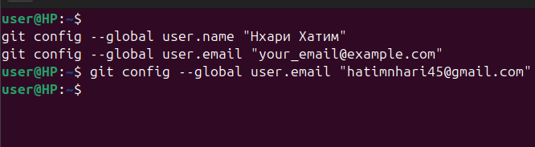
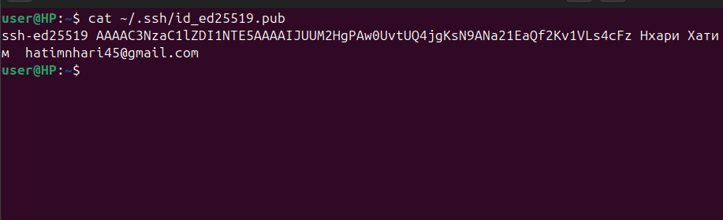
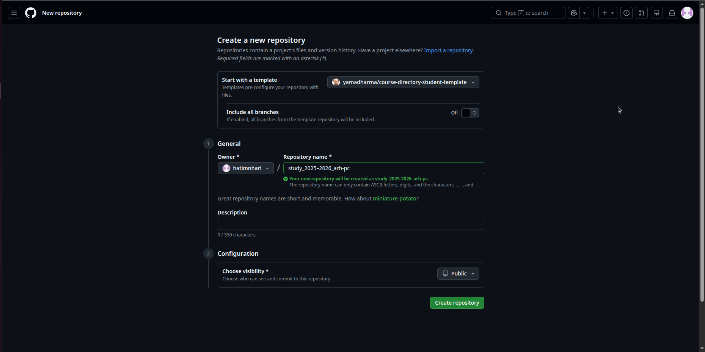
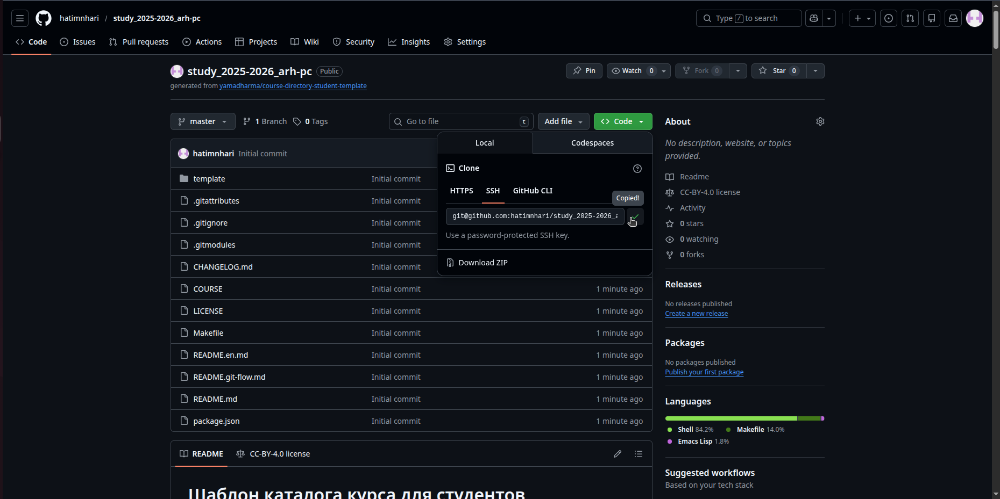
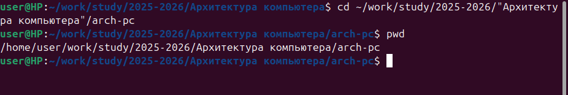
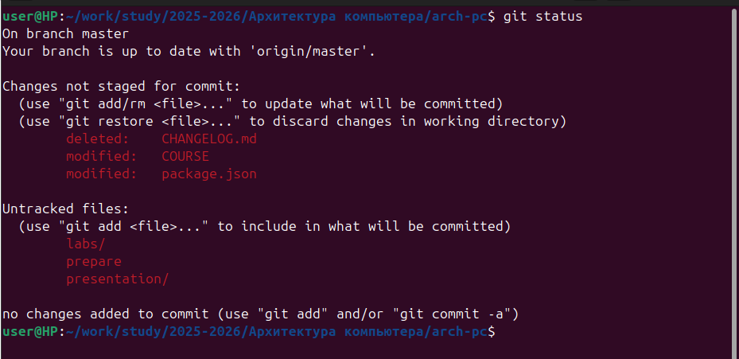
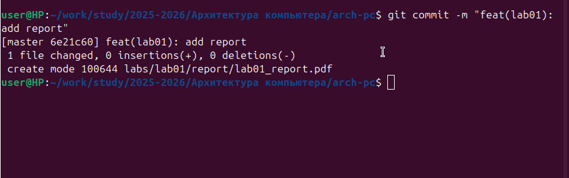

# ОТЧЕТ
## по лабораторной работе №2
## "Система контроля версий Git"

**Выполнил:** Нхари Хатим
**Группа:** НБИбд-03-25
**Дата:** 18.01.2026

---

## 1. Цель работы

Изучение идеологии и применения средств контроля версий, приобретение практических навыков по работе с системой контроля версий Git.

---

## 2. Выполнение лабораторной работы

### 2.1. Настройка GitHub

Для выполнения лабораторной работы необходимо создать учетную запись на сайте GitHub.

**Действия:**
1. Перешел на сайт https://github.com/
2. Создал учетную запись
3. Заполнил основные данные профиля

**Скриншот 1:**

**Комментарий:** GitHub - это веб-сервис для хостинга IT-проектов и их совместной разработки, основанный на системе контроля версий Git.

---

### 2.2. Базовая настройка Git

#### 2.2.1. Настройка имени и email

**Команды:**
```bash
git config --global user.name "Your Name"
git config --global user.email "your_email@example.com"
```

**Скриншот 2:** 

**Комментарий:** Эти настройки указывают имя и email, которые будут использоваться в каждом коммите. Флаг `--global` означает, что настройки применяются глобально для всех репозиториев пользователя.

---

#### 2.2.2. Настройка кодировки и параметров

**Команды:**
```bash
git config --global core.quotepath false
git config --global init.defaultBranch master
git config --global core.autocrlf input
git config --global core.safecrlf warn
```

**Скриншот 3:** 

**Комментарий:** 
- `core.quotepath false` - настройка utf-8 в выводе сообщений git
- `init.defaultBranch master` - установка имени начальной ветки
- `core.autocrlf input` - настройка обработки окончаний строк
- `core.safecrlf warn` - предупреждение о преобразовании окончаний строк

---

#### 2.2.3. Проверка настроек

**Команда:**
```bash
git config --list
```

**Результат:**
```
filter.lfs.required=true
filter.lfs.clean=git-lfs clean -- %f
filter.lfs.smudge=git-lfs smudge -- %f
filter.lfs.process=git-lfs filter-process
user.name=Нхари Хатим
user.email=hatimnhari45@gmail.com
core.quotepath=false
core.autocrlf=input
core.safecrlf=warn
init.defaultbranch=master

```

**Скриншот 4:** 

**Комментарий:** Команда отображает все текущие настройки Git.

---

### 2.3. Создание SSH-ключа

#### 2.3.1. Генерация SSH-ключа

**Команда:**
```bash
ssh-keygen -C "Нхари Хатим  hatimnhari45@gmail.com"
```

**Процесс выполнения:**
```
Generating public/private ed25519 key pair.
Enter file in which to save the key (/home/user/.ssh/id_ed25519): 
Enter passphrase (empty for no passphrase): 
Enter same passphrase again: 
Your identification has been saved in /home/user/.ssh/id_ed25519
Your public key has been saved in /home/user/.ssh/id_ed25519.pub
The key fingerprint is:
SHA256:fr2zDa0oncoXhCjo6WvCKC3Ix5noRj/tAK3ts9aPbYY Нхари Хатим  hatimnhari45@gmail.com
The key's randomart image is:
+--[ED25519 256]--+
|                 |
|                 |
|   .   . .       |
|  o . . . .      |
| o o .  S.       |
| .*    .  .. .   |
|*++o= . ...oo .  |
|*==X.Eo+..+..=   |
|+=++=o+oo+. +o.  |
+----[SHA256]-----+

```

**Скриншот 5:** 

**Комментарий:** SSH-ключ необходим для безопасной аутентификации при работе с удаленным репозиторием без необходимости каждый раз вводить пароль. Ключи сохраняются в каталоге `~/.ssh/`.

---

#### 2.3.2. Копирование открытого ключа

**Команда:**
```bash
cat ~/.ssh/id_ed25519.pub 
```

**Результат:** 
```
ssh-ed25519 AAAAC3NzaC1lZDI1NTE5AAAAIJUUM2HgPAw0UvtUQ4jgKsN9ANa21EaQf2Kv1VLs4cFz Нхари Хатим  hatimnhari45@gmail.com
```

**Скриншот 6:** 

**Комментарий:** Открытый ключ необходимо скопировать для добавления на GitHub. На втором скриншоте скопировали в буффер обмена ключ.

---

#### 2.3.3. Добавление SSH-ключа на GitHub

**Действия:**
1. Перешел на GitHub в Settings
2. Выбрал раздел "SSH and GPG keys"
3. Нажал "New SSH key"
4. Вставил скопированный ключ в поле "Key"
5. Указал название ключа в поле "Title"
6. Нажал "Add SSH key"

**Скриншот 7:** 

**Скриншот 8:** 

**Комментарий:** После добавления ключа на GitHub, можно работать с репозиториями по SSH-протоколу без ввода пароля.

---

### 2.4. Создание рабочего пространства и репозитория курса

#### 2.4.1. Создание структуры каталогов

**Команда:**
```bash
mkdir -p ~/work/study/2025-2026/"Архитектура компьютера"
```

**Проверка:**
```bash
ls -R ~/work/study/
```

**Результат:**
```
/home/user/work/study:
2025-2026

/home/user/work/study/2025-2026:
Архитектура компьютера

/home/user/work/study/2025-2026/Архитектура компьютера:
```

**Скриншот 9:** 
**Комментарий:** Создана рекомендованная структура рабочего пространства для хранения материалов курса.

---

#### 2.4.2. Создание репозитория на основе шаблона

**Действия:**
1. Перешел на страницу шаблона: https://github.com/yamadharma/course-directory-student-template
2. Нажал кнопку "Use this template"
3. Выбрал "Create a new repository"
4. Указал имя репозитория: `study_2025-2026_arch-pc`
5. Оставил репозиторий публичным (Public)
6. Нажал "Create repository from template"

**Скриншот 10:** 

**Скриншот 11:** 

**Скриншот 12:** 
**Комментарий:** Создан репозиторий на основе шаблона, который содержит базовую структуру для курса.

---

### 2.5. Клонирование репозитория

#### 2.5.1. Получение ссылки для клонирования

**Действия:**
1. На странице созданного репозитория нажал кнопку "Code"
2. Выбрал вкладку "SSH"
3. Скопировал ссылку вида: `git@github.com:hatimnhari/study_2025-2026_arch-pc.git`

**Скриншот 13:** 

---

#### 2.5.2. Клонирование репозитория

**Команды:**
```bash
cd ~/work/study/2025-2026/"Архитектура компьютера"
git clone --recursive git@github.com:hatimnhari/study_2025-2026_arh-pc.git arch-pc
```

**Результат:**
```
Cloning into 'arch-pc'...
remote: Enumerating objects: 38, done.
remote: Counting objects: 100% (38/38), done.
remote: Compressing objects: 100% (36/36), done.
remote: Total 38 (delta 1), reused 26 (delta 1), pack-reused 0 (from 0)
Receiving objects: 100% (38/38), 23.57 KiB | 321.00 KiB/s, done.
Resolving deltas: 100% (1/1), done.
Submodule 'template/presentation' (https://github.com/yamadharma/academic-presentation-markdown-template.git) registered for path 'template/presentation'
Submodule 'template/report' (https://github.com/yamadharma/academic-laboratory-report-template.git) registered for path 'template/report'
Cloning into '/home/user/work/study/2025-2026/Архитектура компьютера/arch-pc/template/presentation'...
remote: Enumerating objects: 219, done.        
remote: Counting objects: 100% (219/219), done.        
remote: Compressing objects: 100% (151/151), done.        
remote: Total 219 (delta 86), reused 189 (delta 56), pack-reused 0 (from 0)        
Receiving objects: 100% (219/219), 2.66 MiB | 992.00 KiB/s, done.
Resolving deltas: 100% (86/86), done.
Cloning into '/home/user/work/study/2025-2026/Архитектура компьютера/arch-pc/template/report'...
remote: Enumerating objects: 251, done.        
remote: Counting objects: 100% (251/251), done.        
remote: Compressing objects: 100% (172/172), done.        
remote: Total 251 (delta 111), reused 204 (delta 64), pack-reused 0 (from 0)        
Receiving objects: 100% (251/251), 775.12 KiB | 1.92 MiB/s, done.
Resolving deltas: 100% (111/111), done.
Submodule path 'template/presentation': checked out '1c93acf9e731bf186384c85de4aff70037314240'
Submodule path 'template/report': checked out '8ee157c58b3362947b1c71492a65d4dc6882d5ad'
```

**Скриншот 14:** 

**Комментарий:** Опция `--recursive` клонирует репозиторий вместе со всеми подмодулями. Репозиторий клонирован в каталог `arch-pc`.

---

### 2.6. Настройка каталога курса

#### 2.6.1. Переход в каталог и создание структуры

**Команды:**
```bash
cd ~/work/study/2025-2026/"Архитектура компьютера"/arch-pc
pwd
```

**Результат:**
```
/home/user/work/study/2025-2026/Архитектура компьютера/arch-pc
```

**Скриншот 15:** 

---

**Команды:**
```bash
echo arch-pc > COURSE
make prepare
ls
```

**Результат:** 
```
COURSE  LICENSE   package.json  presentation  README.git-flow.md  template
labs    Makefile  prepare       README.en.md  README.md```
```

**Скриншот 16:** 

**Комментарий:** Команда `make prepare` создает необходимую структуру каталогов согласно Makefile, находящемуся в репозитории.

---

#### 2.6.2. Проверка структуры

**Команда:**
```bash
ls -R
```

**Результат:**
```
.:
COURSE  labs  LICENSE  Makefile  package.json  prepare  presentation  README.en.md  README.git-flow.md  README.md  template

./labs:
lab01  lab02  lab03  lab04  lab05  lab06  lab07  lab08  lab09  lab10  lab11  README.md  README.ru.md

./labs/lab01:
presentation  report

./labs/lab01/presentation:
arch-pc--lab01--presentation.qmd  _assets  image  Makefile  _quarto.yml  _resources

./labs/lab01/presentation/_assets:
auto  beamer.tex

./labs/lab01/presentation/_assets/auto:
beamer.el

./labs/lab01/presentation/image:
kulyabov.jpg

./labs/lab01/presentation/_resources:
image

./labs/lab01/presentation/_resources/image:
logo_rudn.png

./labs/lab01/report:
arch-pc--lab01--report.qmd  _assets  bib  image  Makefile  _quarto.yml  _resources

./labs/lab01/report/_assets:
preamble.tex

./labs/lab01/report/bib:
cite.bib

./labs/lab01/report/image:
solvay.jpg

./labs/lab01/report/_resources:
csl

./labs/lab01/report/_resources/csl:
gost-r-7-0-5-2008-numeric.csl

./labs/lab02:
presentation  report

./labs/lab02/presentation:
arch-pc--lab02--presentation.qmd  _assets  image  Makefile  _quarto.yml  _resources

./labs/lab02/presentation/_assets:
auto  beamer.tex

./labs/lab02/presentation/_assets/auto:
beamer.el

./labs/lab02/presentation/image:
kulyabov.jpg

./labs/lab02/presentation/_resources:
image

./labs/lab02/presentation/_resources/image:
logo_rudn.png

./labs/lab02/report:
arch-pc--lab02--report.qmd  _assets  bib  image  Makefile  _quarto.yml  _resources

./labs/lab02/report/_assets:
preamble.tex

./labs/lab02/report/bib:
cite.bib

./labs/lab02/report/image:
solvay.jpg

./labs/lab02/report/_resources:
csl

./labs/lab02/report/_resources/csl:
gost-r-7-0-5-2008-numeric.csl

./labs/lab03:
presentation  report

./labs/lab03/presentation:
arch-pc--lab03--presentation.qmd  _assets  image  Makefile  _quarto.yml  _resources

./labs/lab03/presentation/_assets:
auto  beamer.tex

./labs/lab03/presentation/_assets/auto:
beamer.el

./labs/lab03/presentation/image:
kulyabov.jpg

./labs/lab03/presentation/_resources:
image

./labs/lab03/presentation/_resources/image:
logo_rudn.png

./labs/lab03/report:
arch-pc--lab03--report.qmd  _assets  bib  image  Makefile  _quarto.yml  _resources

./labs/lab03/report/_assets:
preamble.tex

./labs/lab03/report/bib:
cite.bib

./labs/lab03/report/image:
solvay.jpg

./labs/lab03/report/_resources:
csl

./labs/lab03/report/_resources/csl:
gost-r-7-0-5-2008-numeric.csl

./labs/lab04:
presentation  report

./labs/lab04/presentation:
arch-pc--lab04--presentation.qmd  _assets  image  Makefile  _quarto.yml  _resources

./labs/lab04/presentation/_assets:
auto  beamer.tex

./labs/lab04/presentation/_assets/auto:
beamer.el

./labs/lab04/presentation/image:
kulyabov.jpg

./labs/lab04/presentation/_resources:
image

./labs/lab04/presentation/_resources/image:
logo_rudn.png

./labs/lab04/report:
arch-pc--lab04--report.qmd  _assets  bib  image  Makefile  _quarto.yml  _resources

./labs/lab04/report/_assets:
preamble.tex

./labs/lab04/report/bib:
cite.bib

./labs/lab04/report/image:
solvay.jpg

./labs/lab04/report/_resources:
csl

./labs/lab04/report/_resources/csl:
gost-r-7-0-5-2008-numeric.csl

./labs/lab05:
presentation  report

./labs/lab05/presentation:
arch-pc--lab05--presentation.qmd  _assets  image  Makefile  _quarto.yml  _resources

./labs/lab05/presentation/_assets:
auto  beamer.tex

./labs/lab05/presentation/_assets/auto:
beamer.el

./labs/lab05/presentation/image:
kulyabov.jpg

./labs/lab05/presentation/_resources:
image

./labs/lab05/presentation/_resources/image:
logo_rudn.png

./labs/lab05/report:
arch-pc--lab05--report.qmd  _assets  bib  image  Makefile  _quarto.yml  _resources

./labs/lab05/report/_assets:
preamble.tex

./labs/lab05/report/bib:
cite.bib

./labs/lab05/report/image:
solvay.jpg

./labs/lab05/report/_resources:
csl

./labs/lab05/report/_resources/csl:
gost-r-7-0-5-2008-numeric.csl

./labs/lab06:
presentation  report

./labs/lab06/presentation:
arch-pc--lab06--presentation.qmd  _assets  image  Makefile  _quarto.yml  _resources

./labs/lab06/presentation/_assets:
auto  beamer.tex

./labs/lab06/presentation/_assets/auto:
beamer.el

./labs/lab06/presentation/image:
kulyabov.jpg

./labs/lab06/presentation/_resources:
image

./labs/lab06/presentation/_resources/image:
logo_rudn.png

./labs/lab06/report:
arch-pc--lab06--report.qmd  _assets  bib  image  Makefile  _quarto.yml  _resources

./labs/lab06/report/_assets:
preamble.tex

./labs/lab06/report/bib:
cite.bib

./labs/lab06/report/image:
solvay.jpg

./labs/lab06/report/_resources:
csl

./labs/lab06/report/_resources/csl:
gost-r-7-0-5-2008-numeric.csl

./labs/lab07:
presentation  report

./labs/lab07/presentation:
arch-pc--lab07--presentation.qmd  _assets  image  Makefile  _quarto.yml  _resources

./labs/lab07/presentation/_assets:
auto  beamer.tex

./labs/lab07/presentation/_assets/auto:
beamer.el

./labs/lab07/presentation/image:
kulyabov.jpg

./labs/lab07/presentation/_resources:
image

./labs/lab07/presentation/_resources/image:
logo_rudn.png

./labs/lab07/report:
arch-pc--lab07--report.qmd  _assets  bib  image  Makefile  _quarto.yml  _resources

./labs/lab07/report/_assets:
preamble.tex

./labs/lab07/report/bib:
cite.bib

./labs/lab07/report/image:
solvay.jpg

./labs/lab07/report/_resources:
csl

./labs/lab07/report/_resources/csl:
gost-r-7-0-5-2008-numeric.csl

./labs/lab08:
presentation  report

./labs/lab08/presentation:
arch-pc--lab08--presentation.qmd  _assets  image  Makefile  _quarto.yml  _resources

./labs/lab08/presentation/_assets:
auto  beamer.tex

./labs/lab08/presentation/_assets/auto:
beamer.el

./labs/lab08/presentation/image:
kulyabov.jpg

./labs/lab08/presentation/_resources:
image

./labs/lab08/presentation/_resources/image:
logo_rudn.png

./labs/lab08/report:
arch-pc--lab08--report.qmd  _assets  bib  image  Makefile  _quarto.yml  _resources

./labs/lab08/report/_assets:
preamble.tex

./labs/lab08/report/bib:
cite.bib

./labs/lab08/report/image:
solvay.jpg

./labs/lab08/report/_resources:
csl

./labs/lab08/report/_resources/csl:
gost-r-7-0-5-2008-numeric.csl

./labs/lab09:
presentation  report

./labs/lab09/presentation:
arch-pc--lab09--presentation.qmd  _assets  image  Makefile  _quarto.yml  _resources

./labs/lab09/presentation/_assets:
auto  beamer.tex

./labs/lab09/presentation/_assets/auto:
beamer.el

./labs/lab09/presentation/image:
kulyabov.jpg

./labs/lab09/presentation/_resources:
image

./labs/lab09/presentation/_resources/image:
logo_rudn.png

./labs/lab09/report:
arch-pc--lab09--report.qmd  _assets  bib  image  Makefile  _quarto.yml  _resources

./labs/lab09/report/_assets:
preamble.tex

./labs/lab09/report/bib:
cite.bib

./labs/lab09/report/image:
solvay.jpg

./labs/lab09/report/_resources:
csl

./labs/lab09/report/_resources/csl:
gost-r-7-0-5-2008-numeric.csl

./labs/lab10:
presentation  report

./labs/lab10/presentation:
arch-pc--lab10--presentation.qmd  _assets  image  Makefile  _quarto.yml  _resources

./labs/lab10/presentation/_assets:
auto  beamer.tex

./labs/lab10/presentation/_assets/auto:
beamer.el

./labs/lab10/presentation/image:
kulyabov.jpg

./labs/lab10/presentation/_resources:
image

./labs/lab10/presentation/_resources/image:
logo_rudn.png

./labs/lab10/report:
arch-pc--lab10--report.qmd  _assets  bib  image  Makefile  _quarto.yml  _resources

./labs/lab10/report/_assets:
preamble.tex

./labs/lab10/report/bib:
cite.bib

./labs/lab10/report/image:
solvay.jpg

./labs/lab10/report/_resources:
csl

./labs/lab10/report/_resources/csl:
gost-r-7-0-5-2008-numeric.csl

./labs/lab11:
presentation  report

./labs/lab11/presentation:
arch-pc--lab11--presentation.qmd  _assets  image  Makefile  _quarto.yml  _resources

./labs/lab11/presentation/_assets:
auto  beamer.tex

./labs/lab11/presentation/_assets/auto:
beamer.el

./labs/lab11/presentation/image:
kulyabov.jpg

./labs/lab11/presentation/_resources:
image

./labs/lab11/presentation/_resources/image:
logo_rudn.png

./labs/lab11/report:
arch-pc--lab11--report.qmd  _assets  bib  image  Makefile  _quarto.yml  _resources

./labs/lab11/report/_assets:
preamble.tex

./labs/lab11/report/bib:
cite.bib

./labs/lab11/report/image:
solvay.jpg

./labs/lab11/report/_resources:
csl

./labs/lab11/report/_resources/csl:
gost-r-7-0-5-2008-numeric.csl

./presentation:
presentation  README.md  README.ru.md  report

./presentation/presentation:
arch-pc--presentation--presentation.qmd  _assets  image  Makefile  _quarto.yml  _resources

./presentation/presentation/_assets:
auto  beamer.tex

./presentation/presentation/_assets/auto:
beamer.el

./presentation/presentation/image:
kulyabov.jpg

./presentation/presentation/_resources:
image

./presentation/presentation/_resources/image:
logo_rudn.png

./presentation/report:
arch-pc--presentation--report.qmd  _assets  bib  image  Makefile  _quarto.yml  _resources

./presentation/report/_assets:
preamble.tex

./presentation/report/bib:
cite.bib

./presentation/report/image:
solvay.jpg

./presentation/report/_resources:
csl

./presentation/report/_resources/csl:
gost-r-7-0-5-2008-numeric.csl

./template:
config  presentation  report

./template/config:
course  script

./template/config/course:
arch-pc            infosec        mathmod  net-admin    net-os-admin  os2       practical-scientific-writing  sciprog-intro  simulation-networks
computer-practice  infosec-intro  mathsec  netcybersec  nettech       os-intro  sciprog                       simmod

./template/config/script:
functions  list-courses  prepare

./template/presentation:
CHANGELOG.md  History.md  LICENSE  package.json  presentation  README.git-flow.md  README.md

./template/presentation/presentation:
_assets  image  Makefile  presentation.qmd  _quarto.yml  _resources

./template/presentation/presentation/_assets:
auto  beamer.tex

./template/presentation/presentation/_assets/auto:
beamer.el

./template/presentation/presentation/image:
kulyabov.jpg

./template/presentation/presentation/_resources:
image

./template/presentation/presentation/_resources/image:
logo_rudn.png

./template/report:
CHANGELOG.md  LICENSE  package.json  README.git-flow.md  README.md  README.ru.md  report  scripts

./template/report/report:
_assets  bib  image  Makefile  _quarto.yml  report.qmd  _resources

./template/report/report/_assets:
preamble.tex

./template/report/report/bib:
cite.bib

./template/report/report/image:
solvay.jpg

./template/report/report/_resources:
csl

./template/report/report/_resources/csl:
gost-r-7-0-5-2008-numeric.csl

./template/report/scripts:

```

**Скриншот 17:**

**Комментарий:** Создана полная структура каталогов для всех лабораторных работ.

---

### 2.7. Отправка файлов на GitHub

#### 2.7.1. Добавление файлов в индекс

**Команда:**
```bash
git status
```

**Результат:** 
```
On branch master
Your branch is up to date with 'origin/master'.

Changes not staged for commit:
  (use "git add/rm <file>..." to update what will be committed)
  (use "git restore <file>..." to discard changes in working directory)
	deleted:    CHANGELOG.md
	modified:   COURSE
	modified:   package.json

Untracked files:
  (use "git add <file>..." to include in what will be committed)
	labs/
	prepare
	presentation/

no changes added to commit (use "git add" and/or "git commit -a")

```

**Скриншот 18:** 

---

**Команда:**
```bash
git add .
```

**Комментарий:** Команда добавляет все измененные файлы в индекс (staging area) для последующего коммита.

---

#### 2.7.2. Создание коммита

**Команда:**
```bash
git commit -am 'feat(main): make course structure'
```

**Результат:**
```
[master 755b722] feat(main): make course structure
 248 files changed, 8698 insertions(+), 225 deletions(-)
 delete mode 100644 CHANGELOG.md
 create mode 100644 labs/README.md
 create mode 100644 labs/README.ru.md
 create mode 100644 labs/lab01/presentation/.gitignore
 create mode 100644 labs/lab01/presentation/.marksman.toml
 create mode 100644 labs/lab01/presentation/.projectile
 create mode 100644 labs/lab01/presentation/Makefile
 create mode 100644 labs/lab01/presentation/_assets/auto/beamer.el
 create mode 100644 labs/lab01/presentation/_assets/beamer.tex
 create mode 100644 labs/lab01/presentation/_quarto.yml
 create mode 100644 labs/lab01/presentation/_resources/image/logo_rudn.png
 create mode 100644 labs/lab01/presentation/arch-pc--lab01--presentation.qmd
 create mode 100644 labs/lab01/presentation/image/kulyabov.jpg
 create mode 100644 labs/lab01/report/.gitignore
 create mode 100644 labs/lab01/report/.marksman.toml
 create mode 100644 labs/lab01/report/.projectile
 create mode 100644 labs/lab01/report/Makefile
 create mode 100644 labs/lab01/report/_assets/preamble.tex
 create mode 100644 labs/lab01/report/_quarto.yml
 create mode 100644 labs/lab01/report/_resources/csl/gost-r-7-0-5-2008-numeric.csl
 create mode 100644 labs/lab01/report/arch-pc--lab01--report.qmd
 create mode 100644 labs/lab01/report/bib/cite.bib
 create mode 100644 labs/lab01/report/image/solvay.jpg
 create mode 100644 labs/lab02/presentation/.gitignore
 create mode 100644 labs/lab02/presentation/.marksman.toml
 create mode 100644 labs/lab02/presentation/.projectile
 create mode 100644 labs/lab02/presentation/Makefile
 create mode 100644 labs/lab02/presentation/_assets/auto/beamer.el
 create mode 100644 labs/lab02/presentation/_assets/beamer.tex
 create mode 100644 labs/lab02/presentation/_quarto.yml
 create mode 100644 labs/lab02/presentation/_resources/image/logo_rudn.png
 create mode 100644 labs/lab02/presentation/arch-pc--lab02--presentation.qmd
 create mode 100644 labs/lab02/presentation/image/kulyabov.jpg
 create mode 100644 labs/lab02/report/.gitignore
 create mode 100644 labs/lab02/report/.marksman.toml
 create mode 100644 labs/lab02/report/.projectile
 create mode 100644 labs/lab02/report/Makefile
 create mode 100644 labs/lab02/report/_assets/preamble.tex
 create mode 100644 labs/lab02/report/_quarto.yml
 create mode 100644 labs/lab02/report/_resources/csl/gost-r-7-0-5-2008-numeric.csl
 create mode 100644 labs/lab02/report/arch-pc--lab02--report.qmd
 create mode 100644 labs/lab02/report/bib/cite.bib
 create mode 100644 labs/lab02/report/image/solvay.jpg
 create mode 100644 labs/lab03/presentation/.gitignore
 create mode 100644 labs/lab03/presentation/.marksman.toml
 create mode 100644 labs/lab03/presentation/.projectile
 create mode 100644 labs/lab03/presentation/Makefile
 create mode 100644 labs/lab03/presentation/_assets/auto/beamer.el
 create mode 100644 labs/lab03/presentation/_assets/beamer.tex
 create mode 100644 labs/lab03/presentation/_quarto.yml
 create mode 100644 labs/lab03/presentation/_resources/image/logo_rudn.png
 create mode 100644 labs/lab03/presentation/arch-pc--lab03--presentation.qmd
 create mode 100644 labs/lab03/presentation/image/kulyabov.jpg
 create mode 100644 labs/lab03/report/.gitignore
 create mode 100644 labs/lab03/report/.marksman.toml
 create mode 100644 labs/lab03/report/.projectile
 create mode 100644 labs/lab03/report/Makefile
 create mode 100644 labs/lab03/report/_assets/preamble.tex
 create mode 100644 labs/lab03/report/_quarto.yml
 create mode 100644 labs/lab03/report/_resources/csl/gost-r-7-0-5-2008-numeric.csl
 create mode 100644 labs/lab03/report/arch-pc--lab03--report.qmd
 create mode 100644 labs/lab03/report/bib/cite.bib
 create mode 100644 labs/lab03/report/image/solvay.jpg
 create mode 100644 labs/lab04/presentation/.gitignore
 create mode 100644 labs/lab04/presentation/.marksman.toml
 create mode 100644 labs/lab04/presentation/.projectile
 create mode 100644 labs/lab04/presentation/Makefile
 create mode 100644 labs/lab04/presentation/_assets/auto/beamer.el
 create mode 100644 labs/lab04/presentation/_assets/beamer.tex
 create mode 100644 labs/lab04/presentation/_quarto.yml
 create mode 100644 labs/lab04/presentation/_resources/image/logo_rudn.png
 create mode 100644 labs/lab04/presentation/arch-pc--lab04--presentation.qmd
 create mode 100644 labs/lab04/presentation/image/kulyabov.jpg
 create mode 100644 labs/lab04/report/.gitignore
 create mode 100644 labs/lab04/report/.marksman.toml
 create mode 100644 labs/lab04/report/.projectile
 create mode 100644 labs/lab04/report/Makefile
 create mode 100644 labs/lab04/report/_assets/preamble.tex
 create mode 100644 labs/lab04/report/_quarto.yml
 create mode 100644 labs/lab04/report/_resources/csl/gost-r-7-0-5-2008-numeric.csl
 create mode 100644 labs/lab04/report/arch-pc--lab04--report.qmd
 create mode 100644 labs/lab04/report/bib/cite.bib
 create mode 100644 labs/lab04/report/image/solvay.jpg
 create mode 100644 labs/lab05/presentation/.gitignore
 create mode 100644 labs/lab05/presentation/.marksman.toml
 create mode 100644 labs/lab05/presentation/.projectile
 create mode 100644 labs/lab05/presentation/Makefile
 create mode 100644 labs/lab05/presentation/_assets/auto/beamer.el
 create mode 100644 labs/lab05/presentation/_assets/beamer.tex
 create mode 100644 labs/lab05/presentation/_quarto.yml
 create mode 100644 labs/lab05/presentation/_resources/image/logo_rudn.png
 create mode 100644 labs/lab05/presentation/arch-pc--lab05--presentation.qmd
 create mode 100644 labs/lab05/presentation/image/kulyabov.jpg
 create mode 100644 labs/lab05/report/.gitignore
 create mode 100644 labs/lab05/report/.marksman.toml
 create mode 100644 labs/lab05/report/.projectile
 create mode 100644 labs/lab05/report/Makefile
 create mode 100644 labs/lab05/report/_assets/preamble.tex
 create mode 100644 labs/lab05/report/_quarto.yml
 create mode 100644 labs/lab05/report/_resources/csl/gost-r-7-0-5-2008-numeric.csl
 create mode 100644 labs/lab05/report/arch-pc--lab05--report.qmd
 create mode 100644 labs/lab05/report/bib/cite.bib
 create mode 100644 labs/lab05/report/image/solvay.jpg
 create mode 100644 labs/lab06/presentation/.gitignore
 create mode 100644 labs/lab06/presentation/.marksman.toml
 create mode 100644 labs/lab06/presentation/.projectile
 create mode 100644 labs/lab06/presentation/Makefile
 create mode 100644 labs/lab06/presentation/_assets/auto/beamer.el
 create mode 100644 labs/lab06/presentation/_assets/beamer.tex
 create mode 100644 labs/lab06/presentation/_quarto.yml
 create mode 100644 labs/lab06/presentation/_resources/image/logo_rudn.png
 create mode 100644 labs/lab06/presentation/arch-pc--lab06--presentation.qmd
 create mode 100644 labs/lab06/presentation/image/kulyabov.jpg
 create mode 100644 labs/lab06/report/.gitignore
 create mode 100644 labs/lab06/report/.marksman.toml
 create mode 100644 labs/lab06/report/.projectile
 create mode 100644 labs/lab06/report/Makefile
 create mode 100644 labs/lab06/report/_assets/preamble.tex
 create mode 100644 labs/lab06/report/_quarto.yml
 create mode 100644 labs/lab06/report/_resources/csl/gost-r-7-0-5-2008-numeric.csl
 create mode 100644 labs/lab06/report/arch-pc--lab06--report.qmd
 create mode 100644 labs/lab06/report/bib/cite.bib
 create mode 100644 labs/lab06/report/image/solvay.jpg
 create mode 100644 labs/lab07/presentation/.gitignore
 create mode 100644 labs/lab07/presentation/.marksman.toml
 create mode 100644 labs/lab07/presentation/.projectile
 create mode 100644 labs/lab07/presentation/Makefile
 create mode 100644 labs/lab07/presentation/_assets/auto/beamer.el
 create mode 100644 labs/lab07/presentation/_assets/beamer.tex
 create mode 100644 labs/lab07/presentation/_quarto.yml
 create mode 100644 labs/lab07/presentation/_resources/image/logo_rudn.png
 create mode 100644 labs/lab07/presentation/arch-pc--lab07--presentation.qmd
 create mode 100644 labs/lab07/presentation/image/kulyabov.jpg
 create mode 100644 labs/lab07/report/.gitignore
 create mode 100644 labs/lab07/report/.marksman.toml
 create mode 100644 labs/lab07/report/.projectile
 create mode 100644 labs/lab07/report/Makefile
 create mode 100644 labs/lab07/report/_assets/preamble.tex
 create mode 100644 labs/lab07/report/_quarto.yml
 create mode 100644 labs/lab07/report/_resources/csl/gost-r-7-0-5-2008-numeric.csl
 create mode 100644 labs/lab07/report/arch-pc--lab07--report.qmd
 create mode 100644 labs/lab07/report/bib/cite.bib
 create mode 100644 labs/lab07/report/image/solvay.jpg
 create mode 100644 labs/lab08/presentation/.gitignore
 create mode 100644 labs/lab08/presentation/.marksman.toml
 create mode 100644 labs/lab08/presentation/.projectile
 create mode 100644 labs/lab08/presentation/Makefile
 create mode 100644 labs/lab08/presentation/_assets/auto/beamer.el
 create mode 100644 labs/lab08/presentation/_assets/beamer.tex
 create mode 100644 labs/lab08/presentation/_quarto.yml
 create mode 100644 labs/lab08/presentation/_resources/image/logo_rudn.png
 create mode 100644 labs/lab08/presentation/arch-pc--lab08--presentation.qmd
 create mode 100644 labs/lab08/presentation/image/kulyabov.jpg
 create mode 100644 labs/lab08/report/.gitignore
 create mode 100644 labs/lab08/report/.marksman.toml
 create mode 100644 labs/lab08/report/.projectile
 create mode 100644 labs/lab08/report/Makefile
 create mode 100644 labs/lab08/report/_assets/preamble.tex
 create mode 100644 labs/lab08/report/_quarto.yml
 create mode 100644 labs/lab08/report/_resources/csl/gost-r-7-0-5-2008-numeric.csl
 create mode 100644 labs/lab08/report/arch-pc--lab08--report.qmd
 create mode 100644 labs/lab08/report/bib/cite.bib
 create mode 100644 labs/lab08/report/image/solvay.jpg
 create mode 100644 labs/lab09/presentation/.gitignore
 create mode 100644 labs/lab09/presentation/.marksman.toml
 create mode 100644 labs/lab09/presentation/.projectile
 create mode 100644 labs/lab09/presentation/Makefile
 create mode 100644 labs/lab09/presentation/_assets/auto/beamer.el
 create mode 100644 labs/lab09/presentation/_assets/beamer.tex
 create mode 100644 labs/lab09/presentation/_quarto.yml
 create mode 100644 labs/lab09/presentation/_resources/image/logo_rudn.png
 create mode 100644 labs/lab09/presentation/arch-pc--lab09--presentation.qmd
 create mode 100644 labs/lab09/presentation/image/kulyabov.jpg
 create mode 100644 labs/lab09/report/.gitignore
 create mode 100644 labs/lab09/report/.marksman.toml
 create mode 100644 labs/lab09/report/.projectile
 create mode 100644 labs/lab09/report/Makefile
 create mode 100644 labs/lab09/report/_assets/preamble.tex
 create mode 100644 labs/lab09/report/_quarto.yml
 create mode 100644 labs/lab09/report/_resources/csl/gost-r-7-0-5-2008-numeric.csl
 create mode 100644 labs/lab09/report/arch-pc--lab09--report.qmd
 create mode 100644 labs/lab09/report/bib/cite.bib
 create mode 100644 labs/lab09/report/image/solvay.jpg
 create mode 100644 labs/lab10/presentation/.gitignore
 create mode 100644 labs/lab10/presentation/.marksman.toml
 create mode 100644 labs/lab10/presentation/.projectile
 create mode 100644 labs/lab10/presentation/Makefile
 create mode 100644 labs/lab10/presentation/_assets/auto/beamer.el
 create mode 100644 labs/lab10/presentation/_assets/beamer.tex
 create mode 100644 labs/lab10/presentation/_quarto.yml
 create mode 100644 labs/lab10/presentation/_resources/image/logo_rudn.png
 create mode 100644 labs/lab10/presentation/arch-pc--lab10--presentation.qmd
 create mode 100644 labs/lab10/presentation/image/kulyabov.jpg
 create mode 100644 labs/lab10/report/.gitignore
 create mode 100644 labs/lab10/report/.marksman.toml
 create mode 100644 labs/lab10/report/.projectile
 create mode 100644 labs/lab10/report/Makefile
 create mode 100644 labs/lab10/report/_assets/preamble.tex
 create mode 100644 labs/lab10/report/_quarto.yml
 create mode 100644 labs/lab10/report/_resources/csl/gost-r-7-0-5-2008-numeric.csl
 create mode 100644 labs/lab10/report/arch-pc--lab10--report.qmd
 create mode 100644 labs/lab10/report/bib/cite.bib
 create mode 100644 labs/lab10/report/image/solvay.jpg
 create mode 100644 labs/lab11/presentation/.gitignore
 create mode 100644 labs/lab11/presentation/.marksman.toml
 create mode 100644 labs/lab11/presentation/.projectile
 create mode 100644 labs/lab11/presentation/Makefile
 create mode 100644 labs/lab11/presentation/_assets/auto/beamer.el
 create mode 100644 labs/lab11/presentation/_assets/beamer.tex
 create mode 100644 labs/lab11/presentation/_quarto.yml
 create mode 100644 labs/lab11/presentation/_resources/image/logo_rudn.png
 create mode 100644 labs/lab11/presentation/arch-pc--lab11--presentation.qmd
 create mode 100644 labs/lab11/presentation/image/kulyabov.jpg
 create mode 100644 labs/lab11/report/.gitignore
 create mode 100644 labs/lab11/report/.marksman.toml
 create mode 100644 labs/lab11/report/.projectile
 create mode 100644 labs/lab11/report/Makefile
 create mode 100644 labs/lab11/report/_assets/preamble.tex
 create mode 100644 labs/lab11/report/_quarto.yml
 create mode 100644 labs/lab11/report/_resources/csl/gost-r-7-0-5-2008-numeric.csl
 create mode 100644 labs/lab11/report/arch-pc--lab11--report.qmd
 create mode 100644 labs/lab11/report/bib/cite.bib
 create mode 100644 labs/lab11/report/image/solvay.jpg
 create mode 100644 prepare
 create mode 100644 presentation/README.md
 create mode 100644 presentation/README.ru.md
 create mode 100644 presentation/presentation/.gitignore
 create mode 100644 presentation/presentation/.marksman.toml
 create mode 100644 presentation/presentation/.projectile
 create mode 100644 presentation/presentation/Makefile
 create mode 100644 presentation/presentation/_assets/auto/beamer.el
 create mode 100644 presentation/presentation/_assets/beamer.tex
 create mode 100644 presentation/presentation/_quarto.yml
 create mode 100644 presentation/presentation/_resources/image/logo_rudn.png
 create mode 100644 presentation/presentation/arch-pc--presentation--presentation.qmd
 create mode 100644 presentation/presentation/image/kulyabov.jpg
 create mode 100644 presentation/report/.gitignore
 create mode 100644 presentation/report/.marksman.toml
 create mode 100644 presentation/report/.projectile
 create mode 100644 presentation/report/Makefile
 create mode 100644 presentation/report/_assets/preamble.tex
 create mode 100644 presentation/report/_quarto.yml
 create mode 100644 presentation/report/_resources/csl/gost-r-7-0-5-2008-numeric.csl
 create mode 100644 presentation/report/arch-pc--presentation--report.qmd
 create mode 100644 presentation/report/bib/cite.bib
 create mode 100644 presentation/report/image/solvay.jpg
```

**Скриншот 19:** 

**Комментарий:** Коммит сохраняет изменения в локальном репозитории. Опция `-am` объединяет `git add` для отслеживаемых файлов и создание коммита с сообщением.

---

#### 2.7.3. Отправка изменений на сервер

**Команда:**
```bash
git push
```

**Результат:**
```
Enumerating objects: 73, done.
Counting objects: 100% (73/73), done.
Delta compression using up to 8 threads
Compressing objects: 100% (56/56), done.
Writing objects: 100% (70/70), 700.97 KiB | 1.49 MiB/s, done.
Total 70 (delta 24), reused 0 (delta 0), pack-reused 0
remote: Resolving deltas: 100% (24/24), completed with 1 local object.
To github.com:hatimnhari/study_2025-2026_arh-pc.git
   722217f..755b722  master -> master

```

**Скриншот 20:** 

**Комментарий:** Команда `git push` отправляет все закоммиченные изменения из локального репозитория в удаленный репозиторий на GitHub.

---

#### 2.7.4. Проверка на GitHub

**Действия:**
1. Обновил страницу репозитория на GitHub
2. Проверил наличие созданной структуры каталогов
3. Проверил историю коммитов

**Скриншот 21:** 

**Скриншот 22:** 

**Комментарий:** Все изменения успешно загружены на GitHub, структура каталогов соответствует локальной версии.

---

## 3. Задание для самостоятельной работы

### 3.1. Создание отчета по лабораторной работе №2

**Команды:**
```bash
cd ~/work/study/2025-2026/"Архитектура компьютера"/arch-pc/labs/lab02/report
ls
```

**Результат:** Переход в каталог для отчета по второй лабораторной работе

**Скриншот 23:** 

**Комментарий:** В этом каталоге создается и сохраняется отчет по текущей лабораторной работе.

---

### 3.2. Копирование отчета по лабораторной работе №1

**Команды:**
```bash
cp ~/Documents/lab01_report.pdf ~/work/study/2025-2026/"Архитектура компьютера"/arch-pc/labs/lab01/report/
ls ~/work/study/2025-2026/"Архитектура компьютера"/arch-pc/labs/lab01/report/
```

**Результат:**
```
lab01_report.pdf
```

**Скриншот 24:** 

**Комментарий:** Отчет по первой лабораторной работе скопирован в соответствующий каталог рабочего пространства.

---

### 3.3. Загрузка файлов на GitHub

#### 3.3.1. Проверка статуса репозитория

**Команда:**
```bash
cd ~/work/study/2025-2026/"Архитектура компьютера"/arch-pc
git status
```

**Результат:**
```
On branch master
Your branch is up to date with 'origin/master'.

Untracked files:
  (use "git add <file>..." to include in what will be committed)
	labs/lab01/report/lab01_report.pdf
nothing added to commit but untracked files present (use "git add" to track)

```

**Скриншот 25:** 

**Комментарий:** Git обнаружил новый неотслеживаемый файл.

---

#### 3.3.2. Добавление файлов в индекс

**Команда:**
```bash
git add .
git status
```

**Результат:**
```
On branch master
Your branch is up to date with 'origin/master'.

Changes to be committed:
  (use "git restore --staged <file>..." to unstage)
        new file:   labs/lab01/report/lab01_report.pdf
```

**Скриншот 26:**

**Комментарий:** Файл добавлен в staging area и готов к коммиту.

---

#### 3.3.3. Создание коммита

**Команда:**
```bash
git commit -m "feat(lab01): add report"
```

**Результат:**
```
[master 6e21c60] feat(lab01): add report
 1 file changed, 0 insertions(+), 0 deletions(-)
 create mode 100644 labs/lab01/report/lab01_report.pdf
```

**Скриншот 27:** 

**Комментарий:** Изменения зафиксированы в локальном репозитории с информативным сообщением коммита.

---

#### 3.3.4. Отправка на GitHub

**Команда:**
```bash
git push origin master
```

**Результат:**
```
Enumerating objects: 10, done.
Counting objects: 100% (10/10), done.
Delta compression using up to 8 threads
Compressing objects: 100% (6/6), done.
Writing objects: 100% (6/6), 858.26 KiB | 3.85 MiB/s, done.
Total 6 (delta 3), reused 0 (delta 0), pack-reused 0
remote: Resolving deltas: 100% (3/3), completed with 3 local objects.
To github.com:hatimnhari/study_2025-2026_arh-pc.git
   755b722..6e21c60  master -> master

```

**Скриншот 28:** 

**Комментарий:** Отчет успешно загружен на GitHub.

---

#### 3.3.5. Проверка на GitHub

**Скриншот 29:** 

**Комментарий:** Файлы отчетов видны в соответствующих каталогах на GitHub, история коммитов отображает все выполненные действия.

---

## 4. Основные команды Git

В ходе выполнения лабораторной работы были использованы следующие команды Git:

| Команда | Описание |
|---------|----------|
| `git config --global user.name "Name"` | Настройка имени пользователя |
| `git config --global user.email "email"` | Настройка email пользователя |
| `git clone <url>` | Клонирование удаленного репозитория |
| `git status` | Просмотр состояния репозитория |
| `git add .` | Добавление всех изменений в индекс |
| `git add <file>` | Добавление конкретного файла в индекс |
| `git commit -m "message"` | Создание коммита с сообщением |
| `git commit -am "message"` | Добавление и коммит отслеживаемых файлов |
| `git push` | Отправка изменений в удаленный репозиторий |
| `git pull` | Получение изменений из удаленного репозитория |
| `git log` | Просмотр истории коммитов |

---

## 5. Ответы на контрольные вопросы

**1. Что такое системы контроля версий (VCS) и для решения каких задач они предназначаются?**

Системы контроля версий (Version Control System, VCS) - это программное обеспечение для управления изменениями в файлах проекта. VCS предназначены для:
- Отслеживания истории изменений файлов
- Совместной работы нескольких разработчиков над одним проектом
- Возможности отката к предыдущим версиям
- Разрешения конфликтов при одновременном редактировании
- Создания различных веток разработки
- Сохранения всей истории разработки проекта

---

**2. Объясните следующие понятия VCS и их отношения: хранилище, commit, история, рабочая копия.**

- **Хранилище (Repository)** - место, где хранятся все версии файлов проекта, история изменений и метаданные. Может быть локальным или удаленным.

- **Commit (коммит)** - фиксация изменений в хранилище. Каждый коммит содержит: набор изменений, автора, дату, уникальный идентификатор и сообщение с описанием изменений.

- **История** - последовательность всех коммитов, показывающая эволюцию проекта от начала до текущего состояния.

- **Рабочая копия** - локальная копия файлов проекта, с которой работает пользователь. В ней вносятся изменения, которые затем фиксируются коммитами.

**Взаимосвязь:** Пользователь работает с рабочей копией, вносит изменения, создает коммиты, которые сохраняются в хранилище и формируют историю проекта.

---

**3. Что представляют собой и чем отличаются централизованные и децентрализованные VCS? Приведите примеры VCS каждого вида.**

**Централизованные VCS:**
- Имеют единый центральный сервер с хранилищем
- Пользователи получают рабочие копии файлов
- Для работы необходимо постоянное подключение к серверу
- История хранится только на сервере
- Примеры: CVS, Subversion (SVN), Perforce

**Децентрализованные (распределенные) VCS:**
- Каждый пользователь имеет полную копию репозитория
- Работа возможна без подключения к серверу
- История хранится локально у каждого участника
- Более гибкие возможности ветвления и слияния
- Примеры: Git, Mercurial, Bazaar

**Основное отличие:** В централизованных VCS есть единая точка отказа (центральный сервер), в децентрализованных каждый участник имеет полную копию и может работать автономно.

---

**4. Опишите действия с VCS при единоличной работе с хранилищем.**

При единоличной работе типичный рабочий процесс:

1. Инициализация репозитория: `git init` или клонирование: `git clone`
2. Внесение изменений в файлы проекта
3. Проверка состояния: `git status`
4. Просмотр изменений: `git diff`
5. Добавление изменений в индекс: `git add`
6. Создание коммита: `git commit -m "описание"`
7. Отправка в удаленный репозиторий (если есть): `git push`
8. Периодический просмотр истории: `git log`
9. При необходимости откат к предыдущим версиям: `git checkout` или `git revert`

---

**5. Опишите порядок работы с общим хранилищем VCS.**

При работе в команде:

1. Получение актуальной версии: `git pull`
2. Создание отдельной ветки для задачи: `git checkout -b feature-branch`
3. Внесение изменений в рабочую копию
4. Проверка изменений: `git status`, `git diff`
5. Добавление в индекс: `git add`
6. Создание коммита: `git commit -m "описание"`
7. Получение обновлений из основной ветки: `git pull origin master`
8. Разрешение возможных конфликтов
9. Отправка ветки на сервер: `git push origin feature-branch`
10. Создание pull request (merge request) для проверки
11. После одобрения - слияние с основной веткой: `git merge`
12. Удаление рабочей ветки: `git branch -d feature-branch`

---

**6. Каковы основные задачи, решаемые инструментальным средством git?**

Git решает следующие задачи:

- Контроль версий файлов и отслеживание истории изменений
- Совместная разработка с возможностью параллельной работы
- Управление ветками для разработки различных функций
- Слияние изменений из разных веток
- Разрешение конфликтов при одновременном редактировании
- Откат к предыдущим версиям при необходимости
- Создание тегов для маркировки важных версий
- Работа с удаленными репозиториями
- Сохранение целостности данных через хеширование
- Эффективное хранение данных (дельта-компрессия)

---

**7. Назовите и дайте краткую характеристику командам git.**

**Основные команды:**

- `git init` - инициализация нового репозитория
- `git clone <url>` - клонирование существующего репозитория
- `git status` - отображение состояния рабочей копии
- `git add <file>` - добавление файлов в индекс
- `git commit -m "msg"` - фиксация изменений с сообщением
- `git push` - отправка коммитов в удаленный репозиторий
- `git pull` - получение и слияние изменений из удаленного репозитория
- `git branch` - управление ветками
- `git checkout` - переключение между ветками
- `git merge` - слияние веток
- `git log` - просмотр истории коммитов
- `git diff` - просмотр изменений
- `git rm` - удаление файлов из индекса и рабочей копии
- `git mv` - перемещение/переименование файлов
- `git reset` - отмена изменений
- `git revert` - создание коммита, отменяющего предыдущие изменения

---

**8. Приведите примеры использования при работе с локальным и удалённым репозиториями.**

**Работа с локальным репозиторием:**

```bash
# Создание нового репозитория
git init my-project
cd my-project

# Создание файла
echo "# My Project" > README.md

# Добавление в индекс
git add README.md

# Создание коммита
git commit -m "Initial commit"

# Просмотр истории
git log
```

**Работа с удаленным репозиторием:**

```bash
# Клонирование репозитория
git clone git@github.com:user/repo.git

# Внесение изменений
echo "New content" >> file.txt

# Добавление и коммит
git add file.txt
git commit -m "Update file.txt"

# Получение изменений с сервера
git pull origin master

# Отправка изменений на сервер
git push origin master

# Просмотр удаленных репозиториев
git remote -v
```

---

## 6. Выводы

В ходе выполнения лабораторной работы были изучены основы работы с системой контроля версий Git и приобретены практические навыки:

1. Выполнена базовая настройка Git с указанием имени пользователя, email и других параметров конфигурации.

2. Создан SSH-ключ для безопасной аутентификации на GitHub без необходимости ввода пароля при каждом обращении к удаленному репозиторию.

3. Создана учетная запись на GitHub - популярном веб-сервисе для хостинга Git-репозиториев.

4. Создан репозиторий курса на основе шаблона и настроена рекомендованная структура рабочего пространства.

5. Освоены основные команды Git:
   - Клонирование репозитория (`git clone`)
   - Проверка состояния (`git status`)
   - Добавление файлов в индекс (`git add`)
   - Создание коммитов (`git commit`)
   - Отправка изменений на сервер (`git push`)

6. Успешно загружены отчеты по лабораторным работам в соответствующие каталоги репозитория на GitHub.

Полученные знания и навыки работы с Git являются фундаментальными для современной разработки программного обеспечения и будут активно использоваться в дальнейших лабораторных работах и профессиональной деятельности.

---
